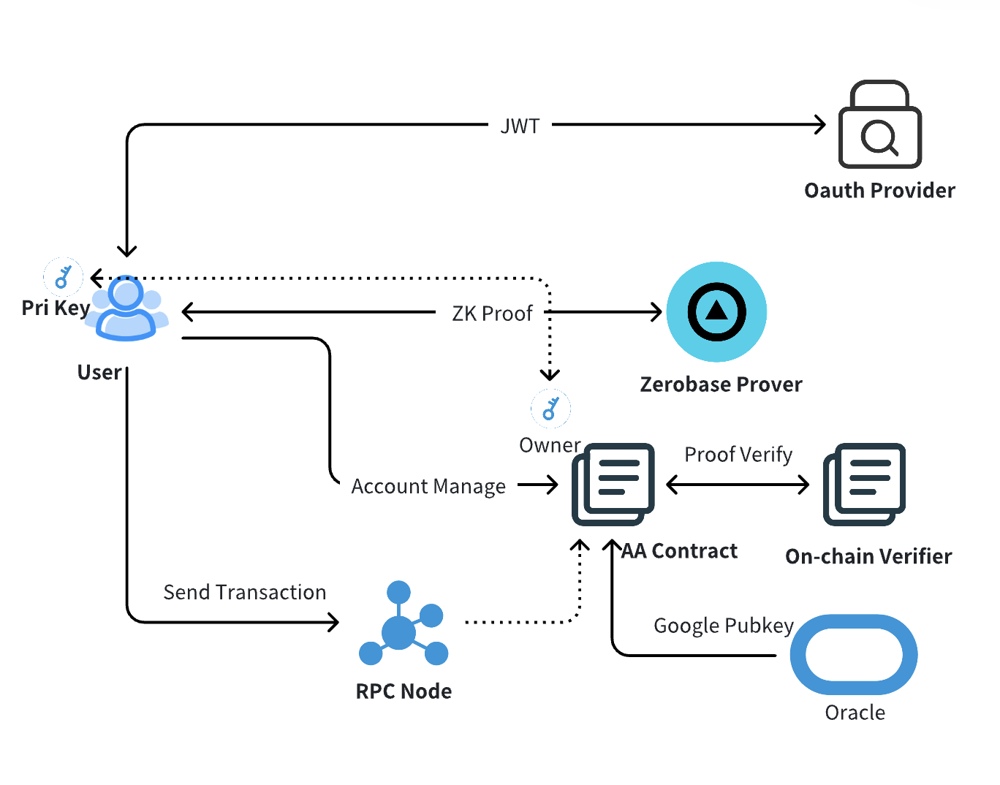

# 业务流程

如下叙述适用为将oauth公钥作为公开输入的电路版本。

### 

# Oracle功能介绍

链下Oracle负责将谷歌Oauth的公钥更新到AA合约中，以便AA合约从Proof Verify结果的公开输出中获取证明的关联谷歌公钥。具体职责包括：

1. 定时获取最新的谷歌公钥数据  
2. 检查当前合约内的最新公钥数据，如果发现更新则进行公钥刷新

# JWT Payload 示例

## 场景一：SMS。如下是一个 JWT 的 payload 示例：

```
{
  "authNonce": "8205186017709859508660632939999119337571865072490932098058920183355571410508",
  "iss": "https://securetoken.google.com/sklogin-35f26",
  "aud": "sklogin-35f26",
  "phone_number": "+8618373233872",
}
```

### 输入参数与处理流程

该 JWT 将与以下参数作为输入，通过前端脚本生成 `ZKLogin_solana.json`，并输入至 prover 生成 proof 和 witness：

- `highpartPK`  
- `lowpartPK`  
- `exp`  
- `project_id`

假设 `scripts/generate_circuit_input.js` 中变量输入为：

```javascript
highpartPK = 190382143502568173121953655840023021428n
lowpartPK = 268907290496916820827766377268916025917n
exp_bigint = 1740656756
project_id = 10006
```

### Witness 生成示例

上述 payload 会产生如下 witness（包含 25 个 `bigint` 的数组）：

```
[
200104116116112115058047047115101099117114101116111107101110046103111
200111103108101046099111109047115107108111103105110045051053102050054
200115107108111103105110045051053102050054
7127763890147960849159333201500040230637305205035149584967442789098807458525
2024841858879950664723963975520030095
2293833913901965663562099879360742582
2085108161076800855610772977535489999
1762734634379572515266880802235119430
447057840158440830007440102626333749
843095074245726941310573529101012953
738318145350872802234100178275232129
1106464730208335804736890163997055636
140698508067250351635990938213217450
1281754911449244346861965017515071285
697896204939881489419392511490512460
949220696447986452985237154413389046
1465493978489733978776055851658825470
1367803428989297115153162323044294701
2549269324917634684569239908306733183
1368860182273110044392825175159449559
3771557191587409074449566276496256
190382143502568173121953655840023021428
268907290496916820827766377268916025917
1740656756
10006
]
```

### Witness 字段说明

1. **`witness[0]`**  
   规则：`'200'` \+ `iss` 前 22 位字符的三位 ASCII 码拼接  
   示例：  
     
   - `iss` 字段前 22 位为 `https://securetoken.go`  
   - ASCII 转换结果：`104116116112115058047047115101099117114101116111107101110046103111`  
   - 最终值：`200` \+ 上述字符串 → `200104116116112115058047047115101099117114101116111107101110046103111`

   

2. **`witness[1]`**  
   规则：`'200'` \+ `iss` 第 23-44 位字符的三位 ASCII 码拼接  
   示例：  
     
   - `iss` 第 23-44 位为 `ogle.com/sklogin-35f26`  
   - ASCII 转换结果：`111103108101046099111109047115107108111103105110045051053102050054`  
   - 最终值：`200` \+ 上述字符串 → `200111103108101046099111109047115107108111103105110045051053102050054`  
3. **`witness[2]`**  
   规则：`'200'` \+ `aud` 前 13 位字符的三位 ASCII 码拼接  
   示例：  
     
   - `aud` 字段前 13 位为 `sklogin-35f26`  
   - ASCII 转换结果：`115107108111103105110045051053102050054`  
   - 最终值：`200` \+ 上述字符串 → `200115107108111103105110045051053102050054`

4. **`witness[3]`**  
   规则：`phone_number` 字段 ASCII 码 使用 `00` Padding 至 16×2 长度后的 Poseidon 哈希  
   示例：  
     
   - `phone_number` 为 `+8618373233872`  
   - ASCII 转换 \+ 使用 `00` Padding 至 16×2：`43565449565155515051515655500000`  
   - Poseidon 哈希结果：`7127763890147960849159333201500040230637305205035149584967442789098807458525`

   

5. **`witness[4]- witness[20]`**

	规则：`JWT的签名公钥，为17个bigint`

6. **后续字段**  
   - `witness[21]` → `highpartPK`  
   - `witness[22]` → `lowpartPK`  
   - `witness[23]` → `exp`  
   - `witness[24]` → `project_id`

7. **对于`witness[0] – witness[2]`，字符数不足的请使用** `000` **Padding 至 (相应位数+1)×3 的长度**  
     
   示例：以 witness\[2\] 为例。某次产生的 `aud` 字段为：`abc`，不足13位。  
   - 三位 ASCII 码拼接转换结果：`097098099`  
   - 最终值：`200` \+ 上述字符串 → `200097098099`  
   - 使用 `000` Padding 至 (13+1) × 3长度：`200097098099000000000000000000000000000000`


## 场景二：EMAIL。如下是一个 JWT 的 payload 示例：

```
{
  "authNonce": "8205186017709859508660632939999119337571865072490932098058920183355571410508",
  "iss": "https://securetoken.google.com/sklogin-35f26",
  "aud": "sklogin-35f26",
  "email": "laonianrencaozuo@gmail.com",
}
```

上述 payload 会产生如下 witness（包含 25 个 `bigint` 的数组）：

```
[
200104116116112115058047047115101099117114101116111107101110046103111
200111103108101046099111109047115107108111103105110045051053102050054
200115107108111103105110045051053102050054
8221293801905454488570447792679227103271972158867850021273786099763738695508
2024841858879950664723963975520030095
2293833913901965663562099879360742582
2085108161076800855610772977535489999
1762734634379572515266880802235119430
447057840158440830007440102626333749
843095074245726941310573529101012953
738318145350872802234100178275232129
1106464730208335804736890163997055636
140698508067250351635990938213217450
1281754911449244346861965017515071285
697896204939881489419392511490512460
949220696447986452985237154413389046
1465493978489733978776055851658825470
1367803428989297115153162323044294701
2549269324917634684569239908306733183
1368860182273110044392825175159449559
3771557191587409074449566276496256
190382143502568173121953655840023021428
268907290496916820827766377268916025917
1740656756
10006
]
```

### Witness 字段说明

1. **`witness[0]`**  
   规则：`'200'` \+ `iss` 前 22 位字符的三位 ASCII 码拼接  
   示例：  
     
   - `iss` 字段前 22 位为 `https://securetoken.go`  
   - ASCII 转换结果：`104116116112115058047047115101099117114101116111107101110046103111`  
   - 最终值：`200` \+ 上述字符串 → `200104116116112115058047047115101099117114101116111107101110046103111`

   

2. **`witness[1]`**  
   规则：`'200'` \+ `iss` 第 23-44 位字符的三位 ASCII 码拼接  
   示例：  
     
   - `iss` 第 23-44 位为 `ogle.com/sklogin-35f26`  
   - ASCII 转换结果：`111103108101046099111109047115107108111103105110045051053102050054`  
   - 最终值：`200` \+ 上述字符串 → `200111103108101046099111109047115107108111103105110045051053102050054`  
3. **`witness[2]`**  
   规则：`'200'` \+ `aud` 前 13 位字符的三位 ASCII 码拼接  
   示例：  
     
   - `aud` 字段前 13 位为 `sklogin-35f26`  
   - ASCII 转换结果：`115107108111103105110045051053102050054`  
   - 最终值：`200` \+ 上述字符串 → `200115107108111103105110045051053102050054`

4. **`witness[3]`**  
   规则：Poseidon(\[`'200'` \+ `email` 前 20 位字符的三位 ASCII 码拼接，`'200'` \+ `email` 第 21-40 位字符的三位 ASCII 码拼接\])  
   示例：`email` 为 `laonianrencaozuo@gmail.com`

   - `email`第 1-20 位为 `laonianrencaozuo@gma` (如email字符长度小于20需使用 `000` Padding 至 21×3)  
   - `200` \+ ASCII 转换结果：`200108097111110105097110114101110099097111122117111064103109097`  
   - `email`第 21-40 位为 `il.com`  (需使用 `000` Padding 至 21×3)  
   - `200` \+ ASCII 转换结果：`200105108046099111109000000000000000000000000000000000000000000`  
   - Poseidon 哈希结果：  
   - Poseidon(\[`200108097111110105097110114101110099097111122117111064103109097n`, `200105108046099111109000000000000000000000000000000000000000000n`\]) \==  
   - `8221293801905454488570447792679227103271972158867850021273786099763738695508`

   

5. **`witness[4]- witness[20]`**

	规则：`JWT的签名公钥，为17个bigint`

6. **后续字段**  
   - `witness[21]` → `highpartPK`  
   - `witness[22]` → `lowpartPK`  
   - `witness[23]` → `exp`  
   - `witness[24]` → `project_id`

